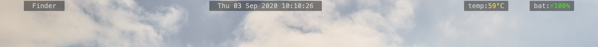

# Bar

A simple menubar created using Übersicht. Inspired by [zenbar](https://github.com/paulrouget/zenbar)



Consists of the following features:

- Focused/currently active app (`focus.jsx`)
- Date and time (`time.jsx`)
- CPU Temperature (`cpu.jsx`)
- Battery charge and status (`battery.jsx`)

## Installation

Make sure you have [Übersicht](http://tracesof.net/uebersicht/) installed.

The Focused widget makes use of [yabai](https://github.com/koekeishiya/yabai), the window manager for macOS. If you do not wish to use yabai, replace the line in `focus.jsx`:

```javascript
export const command = "/usr/local/bin/yabai -m query --windows --window";
```

with the corresponding AppleScript command:

```javascript
export const command =
  "osascript -e 'tell application \"System Events\"' -e 'set frontApp to name of first application process whose frontmost is true' -e 'end tell'";
```

The CPU Temperature widget makes use of [osx-cpu-temp](https://github.com/lavoiesl/osx-cpu-temp). Install it with `brew install osx-cpu-temp`.

Run the following command:

```bash
git clone https://github.com/vrishk/bar $HOME/Library/Application\ Support/Übersicht/widgets/bar
```

